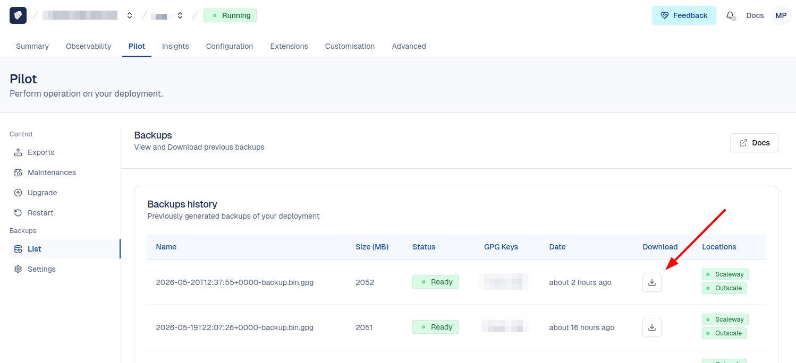

# Cloud-IAM deployment restore

Spin up a local Postgres + Keycloak stack seeded from a [Cloud-IAM](https://www.cloud-iam.com) cold backup.

## 1. Download a backup from Cloud-IAM

To reuse a backup locally, first attach a [GPG key to your organization](https://documentation.cloud-iam.com/how-to-guides/backups.html#how-to-create-a-gpg-key-and-import-on-cloud-iam-console).
This protects the data in transit and at rest: only Cloud-IAM and you can decrypt it.

Once the key is registered, download the latest `*-backup.bin.gpg` for your deployment from the Cloud-IAM UI or API.



## 2. Decrypt it

```sh
gpg --batch --yes --pinentry-mode=loopback \
    --passphrase "$GPG_PASSPHRASE" \
    --decrypt --output backups/foo-backup.bin \
    foo-backup.bin.gpg
```

The decrypted `*.bin` must land in `backups/`.

## 3. Configure `.env`

```sh
cp .env.example .env
# tweak ports and credentials if the defaults don't suit you
```

Optional extras:

- `cp keycloak.env.example keycloak.env` — declare extra `KC_*` env vars
  forwarded to Keycloak.
- drop custom extension jars into `providers/` — bind-mounted to
  `/opt/keycloak/providers/`.

## 4. Start

```sh
docker compose up -d
```

Keycloak is served on http://localhost:8080. Sign in with the admin credentials from your Cloud-IAM deployment.

## 5. Wipe everything

```sh
docker compose down -v
```

Stops the containers and removes the `pgdata` volume, so the next
`docker compose up -d` re-imports the backup from scratch.